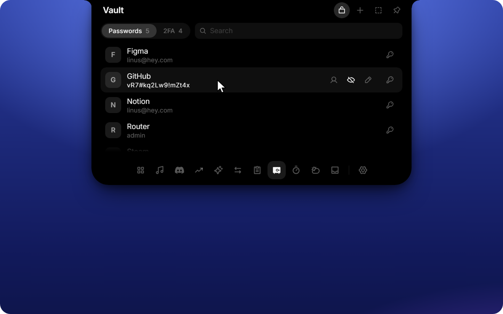
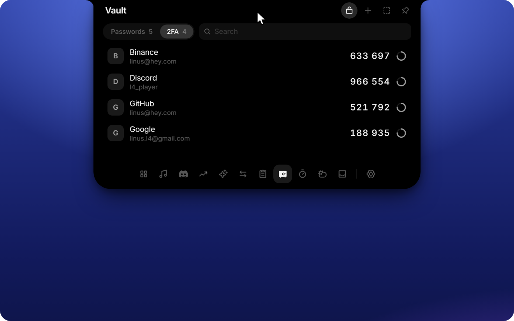
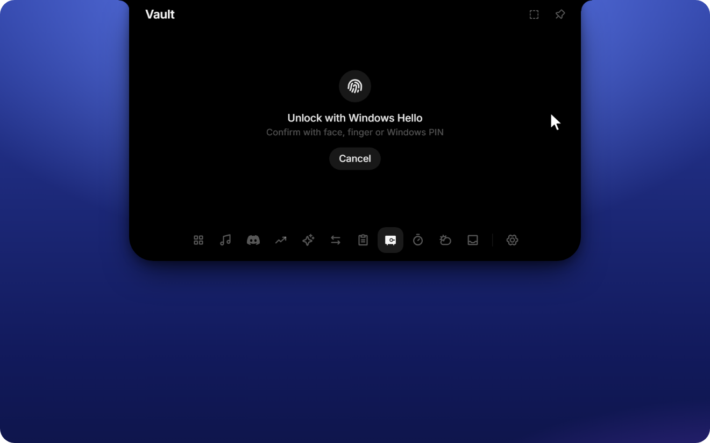
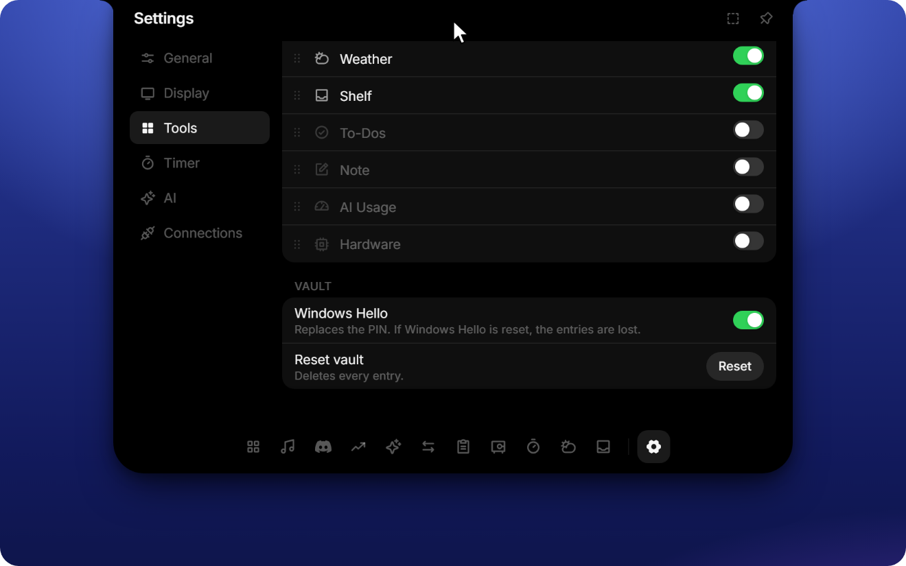

<h1 align="center">L4-Notchbar</h1>

<p align="center">
  <b>Windows never had a Dynamic Island. Now it does.</b>
</p>

<p align="center">
  <a href="https://github.com/Linux5Real/L4-Windows-NotchBar/releases/latest"></a>
  
  <a href="LICENSE"></a>
</p>

<p align="center">
  <a href="https://github.com/Linux5Real/L4-Windows-NotchBar/releases/latest"><b>Download</b></a>
  &nbsp;·&nbsp;
  <a href="#what-it-does"><b>Features</b></a>
  &nbsp;·&nbsp;
  <a href="https://github.com/Linux5Real/L4-Windows-NotchBar/issues/new"><b>Suggest an idea</b></a>
</p>

https://github.com/user-attachments/assets/0883a7b8-6197-4a75-9c49-da58bf644983

A Dynamic-Island-style notch for Windows. It sits at the top of your screen, stays out of the way until you need it, and opens on hover, click or **Ctrl + Alt + Space**.

Inside: music controls with a live equalizer, a vault for passwords and 2FA codes, live weather, your Discord call, your portfolio, an AI chat (Claude, ChatGPT and more) with your usage limits, clipboard history, a file shelf, a file and unit converter, timers, to-dos and notes, live hardware stats with FPS for games, and privacy dots for mic, camera and screen recording.

Make it yours: reorder or hide any tool, move the notch, pick the monitor, hide it automatically in fullscreen apps, or triple-click it to fade it out when it's in the way. All of that in a single executable of a few megabytes, with smooth animations throughout.

> [!TIP]
> **Missing something?** If you have an idea for a new tool, a feature you'd love to see or something that bugs you, just [open an issue](https://github.com/Linux5Real/L4-Windows-NotchBar/issues/new) and describe it. Every idea is welcome.

## What it does

### Windows and system

- **Overview** is a small control center: time, weather, what is playing right now, Windows focus and a volume slider.
- **Now Playing** controls anything with a Windows media session (Spotify, browser players and so on) and shows cover, title, progress and a live equalizer driven by the actual audio output.
- **Clipboard** keeps a history of text, links, images and files, with filters and previews. Password managers are excluded on purpose, and nothing is written to disk.
- **Shelf** is a parking spot for files. Drop them onto the Notch or press Ctrl + V, then open, copy or reveal them later.
- **Hardware** shows live CPU, RAM, GPU, VRAM and ping, with history that keeps recording while the Notch is closed.
- **Gaming mode** puts FPS, CPU, GPU and RAM into the closed Notch, always or only while a fullscreen app runs. FPS works for DirectX, OpenGL and Vulkan games. Windows only allows this for members of the *Performance Log Users* group: click **Settings → Display → Unlock FPS** once, confirm the Windows prompt, then sign out and back in. A lock icon in the Notch means this step is still missing.
- **Privacy dots** turn green when the microphone or camera is in use and red while the screen is being recorded, like on an iPhone.

### Services

- **Ask** is a chat with Claude, ChatGPT, OpenRouter or any OpenAI-compatible endpoint, with streaming and adjustable reasoning effort.
- **AI usage** shows your subscription limits for Claude, ChatGPT, Gemini and Cursor.
- **Weather** gives current conditions and a 7-day forecast through Open-Meteo. No API key needed.
- **Portfolio** connects to Trading 212 and shows profit and loss and a history chart, live or in demo mode. The app only reads, it never trades.
- **Discord** shows your current voice call with speaking members and buttons for mute, deafen and hang up. In the closed Notch, a green equalizer plays while someone talks.

### Local and offline

- **Timer** with focus and break presets, custom durations, six alarm sounds and a running countdown in the closed Notch. An expired timer stays visible until you dismiss it.
- **To-dos** and **notes** live on your machine and need no account.
- **Converter** handles units, images (PNG, JPG, WebP, ICO, BMP, DDS), documents (PDF, DOCX, TXT, Markdown, HTML), spreadsheets (XLSX, CSV, JSON) and audio or video if ffmpeg is installed.

## New in 1.1: Vault

Passwords and two-factor codes, one hover away and encrypted on your PC.

<p>
  
  
</p>

- **Passwords** with name and username or email. Copy either one with a click, show or edit the password, or let the generator create a strong one.
- **2FA codes** with a live countdown. Screenshot the QR code (Win + Shift + S) and press **Ctrl + V**, or type the key, then name it.
- **4-digit PIN** before anything secret is shown or copied, adjustable for passwords and 2FA separately in **Settings → Tools → Vault**. Five wrong tries lock it for 30 seconds, doubling from there.
- **Never in clipboard history.** Copies skip the Notch clipboard and Windows' Win + V history, and passwords and codes leave the clipboard after 30 seconds.
- **Local only**, encrypted with Windows DPAPI and bound to your Windows account. Forgot the PIN? **Reset vault** in settings deletes everything; there is no back door.
- **Windows Hello (new in 1.2, optional):** unlock with face, fingerprint or Windows PIN instead of the vault PIN. Secrets are then additionally encrypted with a key from your PC's security chip, so even malware running as you can't read them without your confirmation.

<p>
  
  
</p>

The vault is off by default; turn it on under **Settings → Tools**.

## Install

1. Download `L4-Notchbar_x.y.z_x64-setup.exe` from the [latest release](https://github.com/Linux5Real/L4-Windows-NotchBar/releases/latest).
2. Run it. No Node, Rust or admin rights needed; it installs for your user only.
3. The notch appears at the top of your screen and starts with Windows from then on.

Built and tested on Windows 11; Windows 10 should work but is untested. If WebView2 is missing, the installer fetches it automatically.

The installer is not code-signed yet, so Windows SmartScreen may warn on first launch. Click **More info → Run anyway**.

## Using it

| Action | How |
| --- | --- |
| Open or close | Hover, click or **Ctrl + Alt + Space** (choose the trigger in settings) |
| Switch tools | Tool bar at the bottom of the open Notch |
| Settings | Gear icon at the end of the tool bar, or **Settings …** in the tray menu |
| Tray icon | Left click opens the Notch, right click shows the menu (open, settings, autostart, quit) |
| Move the Notch | Drag it sideways, either closed or by its header. "Reset to center" is in settings |
| Focus mode | Click the Notch three times quickly. It turns half transparent and clicks pass through. Three more clicks bring it back |
| Add files | Drag them onto the Notch, or paste with Ctrl + V |

## Settings

Settings are grouped into General, Display, Tools, Timer, AI and Connections. There you can reorder (drag) or hide tools, pick the monitor, hide the Notch automatically during fullscreen apps, enable autostart and switch between German and English.

### Setting up the integrations

Every integration is optional. Tools you don't connect simply stay out of your way.

**Ask (AI chat).** Under **AI**, choose a provider (Claude, ChatGPT, OpenRouter or a custom endpoint) and paste your API key. For a custom endpoint, enter the base URL (usually ending in `/v1`) and a model ID. The reasoning effort is set there too.

**AI usage.** Nothing to enter. If you are signed in to Claude Code, the Codex CLI, the Gemini CLI or Cursor on this PC, the Notch reads their existing local login and shows your limits.

**Portfolio.** In Trading 212 go to Settings, API (Beta) and create a key with permission for account data and portfolio. Nothing more is required. Paste key and secret under **Connections** and choose live or demo account.

**Discord.** Discord only hands out voice permissions to your own application:

1. Create an application at [discord.com/developers](https://discord.com/developers).
2. Under OAuth2, copy the **Client ID** and **Client Secret** into **Connections**.
3. Under OAuth2, Redirects, add `http://localhost` and save. Without it Discord keeps asking for permission again.
4. Join a call. Discord asks you once to confirm.

**Weather.** Works out of the box with your approximate location (city level, from your IP). Pick a city by hand in the weather tool if you prefer; then the IP lookup stops.

## Your data stays on your PC

L4-Notchbar has no account, no server of its own, no analytics and no tracking. Everything it stores (settings, to-dos, notes, timer presets) lives on your machine. The clipboard history is kept in memory only and never written to disk.

- **Keys and secrets** are stored in the Windows Credential Manager, never in a plain file, and they are never sent back to the interface.
- **The vault** lives in one file encrypted with Windows DPAPI, readable only under your Windows account. The PIN is checked in the app's backend, not in the interface, and 2FA keys never leave the backend. With Windows Hello turned on, secrets are additionally sealed with AES-256-GCM under a TPM-backed Windows Hello key.
- **Integrations talk directly to their own service** and nowhere else: Ask to the AI provider you chose, Portfolio to Trading 212, Discord to the Discord app on your PC (and discord.com for the sign-in), AI usage to the provider you are signed in to, Weather to Open-Meteo (plus an IP-based city lookup unless you picked a city). If you don't set an integration up, it makes no requests.
- **Updates.** Once a day the app makes a single anonymous request to this repository's public release page to check for a new version. No personal data is sent. If an update exists, a dot appears on the gear icon and **Settings → General → Updates** shows it. Nothing is downloaded until you click **Update now**; the app then installs the update and restarts. Every update is cryptographically signed and verified before it is installed. You can turn the daily check off in the same place.

## Development

Built with **Tauri 2, React 19, TypeScript, Motion and Tailwind 4**. The app uses WebView2 instead of bundling Chromium, which keeps the release build at a few megabytes. Animations stay smooth because the window itself never resizes. Only the content inside it moves.

You need Node 22 or newer and Rust (stable). On Windows, the Visual Studio Build Tools with the C++ workload and a Windows 11 SDK are required for linking.

```bash
npm install
npm run dev        # browser with a fake desktop, ?slow=4 slows animations for tuning
npm run tauri dev  # the real app, run it in PowerShell
npm run typecheck  # before every commit
npm run i18n       # finds missing English strings (add --fix for TODO entries)
```

In the browser, `?showcase` switches to English with curated demo data (music, Discord call, portfolio, chat). It is what the film above was captured from.

To build a standalone executable:

```bash
npx tauri build --no-bundle   # result: src-tauri/target/release/notch.exe
```

### Releasing

Releases are built by GitHub Actions (`.github/workflows/release.yml`). Bump the version, commit and push:

```bash
npm run bump 1.1.0
git commit -am "release 1.1.0"
git push
```

The workflow builds the signed installer and publishes release `v1.1.0` with the installer, its signature and `latest.json`, which installed apps use to offer the update. Pushes without a version bump don't create a release. The signing key lives in the repository secret `TAURI_SIGNING_PRIVATE_KEY`.

Run Tauri commands from PowerShell. In Git Bash, `/usr/bin/link` shadows the MSVC linker and the build fails.

### Project layout

```
src/            React frontend: notch shape, tools, design tokens, i18n
src-tauri/      Rust backend: window, hit testing, tray and the Windows APIs
scripts/        Helper scripts such as the i18n check
```

## License

[GPL-3.0](LICENSE). You may use, study, change and share this project, also commercially, but any version you distribute must stay open source under the same license and keep the copyright notice.

The notch proportions were derived from [NotchDrop](https://github.com/Lakr233/NotchDrop) (MIT). The design follows Apple's Dynamic Island and the macOS app OmniNotch; this project is not affiliated with Apple or OmniNotch.
